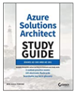

# New or modified Azure products and features
This file will be updated with new Azure products and features or changes to existing products and features which need mentioning.  If and when this book gets updated, these topics should be included.

Review already reported Errata [here](https://github.com/benperk/ASA/issues?q=is%3Aissue+is%3Aclosed) which will be corrected in the near term.

## Chapter 1 - Gaining the Azure Solutions Architect Expert Certification 
- [Azure Arc](https://azure.microsoft.com/en-us/services/azure-arc/) -> Chapter 4
- [Azure Resource Mover](https://docs.microsoft.com/en-us/azure/resource-mover) -> Chapter 8
  - Resolve any ambiguity regarding - **Azure Site Recovery, Recovery Services Vault and Azure Migrate**
- [Azure Automanage](https://azure.microsoft.com/en-us/updates/public-preview-announcing-new-capabilities-for-azure-automanage/) => Chapter 9
- [Static Web Apps](https://azure.microsoft.com/en-us/services/app-service/static/) -> Chapter 4
  - Compare and contrast with [static website on Blob Storage](https://docs.microsoft.com/en-us/azure/storage/blobs/storage-blob-static-website-host) 
- [Azure Attestation](https://docs.microsoft.com/en-us/azure/attestation/overview) -> Chapter 2
- [Azure Spring Cloud](https://docs.microsoft.com/en-us/azure/spring-cloud/overview) -> Chapter 4
## Chapter 2 - Security and Identity
- [Azure Bastion](https://docs.microsoft.com/en-us/azure/bastion/bastion-overview) -> Chapter 4
- [Trusted launch for Azure virtual machines](https://docs.microsoft.com/en-us/azure/virtual-machines/trusted-launch) -> Chapter 4
- [Azure Sentinel](https://docs.microsoft.com/en-us/azure/sentinel/overview)
- [Azure Attestation](https://docs.microsoft.com/en-us/azure/attestation/overview)
- [(RBAC) with (AAD) on Azure Cosmos DB](https://azure.microsoft.com/en-us/updates/rolebased-access-control-rbac-with-azure-active-directory-aad-on-azure-cosmos-db-in-public-preview/)
- [Azure resource provider operations](https://docs.microsoft.com/en-us/azure/role-based-access-control/resource-provider-operations) -> and Table 8.4
- [Protect Applications Against DDoS Attacks](https://techcommunity.microsoft.com/t5/azure-security-center/security-control-protect-applications-against-ddos-attacks/ba-p/2169373)
- [Manage Access and Permissions](https://techcommunity.microsoft.com/t5/azure-security-center/security-control-manage-access-and-permissions/ba-p/1720540)
- [Azure Security Architect Map](https://techcommunity.microsoft.com/t5/azure-developer-community-blog/the-azure-security-architect-map/ba-p/714091)
- [What's the difference between Azure Security Center, Azure Defender and Azure Sentinel?](https://techcommunity.microsoft.com/t5/itops-talk-blog/what-s-the-difference-between-azure-security-center-azure/ba-p/2155188)
- [New Azure Security Benchmark Foundation helps organizations embrace zero trust](https://devblogs.microsoft.com/azuregov/new-azure-security-benchmark-foundation-helps-organizations-embrace-zero-trust/) -> Chapter 6
- [Azure security baseline for Azure Cosmos DB](https://docs.microsoft.com/en-us/azure/cosmos-db/security-baseline) -> Chapter 5
- [Security Control: Encrypt data in transit](https://techcommunity.microsoft.com/t5/azure-security-center/security-control-encrypt-data-in-transit/ba-p/2201008)
- [Multivariate Anomaly Detection](https://techcommunity.microsoft.com/t5/azure-ai/introducing-multivariate-anomaly-detection/ba-p/2260679)
### Cloud App Security
- [Cloud App Security March](https://techcommunity.microsoft.com/t5/microsoft-security-and/microsoft-cloud-app-security-update-march-2021/ba-p/2157650) -> Chapter 6 (Compliance/Governance) and Chapter 8 (Migrate/Discovery)
### Managed Identity
- [What are managed identities for Azure resources?](https://docs.microsoft.com/en-us/azure/active-directory/managed-identities-azure-resources/overview)
- [How to use managed identities for Azure resources on an Azure VM for sign-in](https://docs.microsoft.com/en-us/azure/active-directory/managed-identities-azure-resources/how-to-use-vm-sign-in)
- [System-assigned managed identity](https://docs.microsoft.com/en-us/azure/active-directory/managed-identities-azure-resources/qs-configure-powershell-windows-vm#system-assigned-managed-identity)
## Chapter 3 - Networking
- [What is Azure Private Endpoint?](https://docs.microsoft.com/en-us/azure/private-link/private-endpoint-overview)
- [Multiple new features for Azure VPN Gateway](https://azure.microsoft.com/en-us/updates/multiple-new-features-for-azure-vpn-gateway-in-public-preview/)
- [Azure Route Server](https://azure.microsoft.com/en-us/updates/public-preview-azure-route-server/)
- [Azure Routing Preference](https://azure.microsoft.com/en-us/updates/azure-routing-preference-is-now-generally-available/) -> see Chapter 5
- [Network Connectivity Monitoring with Connection Monitor](https://docs.microsoft.com/en-us/azure/network-watcher/connection-monitor-overview)
  - [We’re retiring Azure Network Watcher Connection Monitor](https://azure.microsoft.com/en-us/updates/we-re-retiring-azure-network-watcher-connection-monitor-classic-on-29-february-2024/)
- [AllowUpdateAddressSpaceInPeeredVnets](https://docs.microsoft.com/en-us/answers/questions/228836/allowupdateaddressspaceinpeeredvnets.html)
  - Keep an eye on this one [Add IP address spaces to peered virtual networks](https://docs.microsoft.com/en-us/azure/architecture/networking/prefixes/add-ip-space-peered-vnet) 
- [Azure Web Application Firewall (WAF) / using exclusion lists](https://docs.microsoft.com/en-us/azure/web-application-firewall/afds/waf-front-door-tuning#using-exclusion-lists)
- [Multi-region load balancing with Traffic Manager and Application Gateway](https://docs.microsoft.com/en-us/azure/architecture/high-availability/reference-architecture-traffic-manager-application-gateway) 
- [Azure Firewall Premium](https://azure.microsoft.com/en-us/updates/azure-firewall-premium-now-in-public-preview)
- [Azure Front Door Standard and Premium](https://azure.microsoft.com/en-us/updates/azure-front-door-standard-and-premium-now-in-public-preview/)
- Increase coverage of [Service Tags](https://docs.microsoft.com/en-us/azure/virtual-network/service-tags-overview) p. 170
- [DNS Load Balancing](https://thetechl33t.com/2020/12/21/dns-load-balancing-in-azure/)
- [IPv6 Support for ExpressRoute Private Peering](https://azure.microsoft.com/en-us/updates/eripv6/)
- [Application Gateway URL Rewrite](https://azure.microsoft.com/en-us/updates/general-availability-application-gateway-url-rewrite/)
## Chapter 4 - Compute
- [Azure Arc](https://azure.microsoft.com/en-us/services/azure-arc/)
- [Web App for Containers](https://azure.microsoft.com/en-us/services/app-service/containers/)
- [Running Nextflow Data Pipelines on Azure Batch](https://techcommunity.microsoft.com/t5/azure-compute/running-nextflow-data-pipelines-on-azure-batch/ba-p/2150383)
- [Beginner's Series to: Dev Containers](https://techcommunity.microsoft.com/t5/educator-developer-blog/beginner-s-series-to-dev-containers/ba-p/2155792)
- [Enable multiple Availability zones in single virtual machine scale set](https://docs.microsoft.com/en-us/azure/service-fabric/service-fabric-cross-availability-zones#preview-enable-multiple-availability-zones-in-single-virtual-machine-scale-set)
- [Static Web Apps](https://azure.microsoft.com/en-us/services/app-service/static/)
- [Host a static website in Azure Storage](https://docs.microsoft.com/en-us/azure/storage/blobs/storage-blob-static-website-how-to?tabs=azure-portal) -> Chapter 5
- [Azure Spring Cloud](https://docs.microsoft.com/en-us/azure/spring-cloud/overview) -> Chapter 4
- [Migration of Azure Cloud Services (classic) to Azure Resource Manager](https://azure.microsoft.com/en-us/updates/cloud-services-arm-migration/)
- [AKS encryption at rest](https://azure.microsoft.com/en-us/updates/general-availability-encryption-at-host-support-in-aks/)
### Azure Virtual Machines
- [Azure Bastion](https://docs.microsoft.com/en-us/azure/bastion/bastion-overview)
- [Trusted launch for Azure virtual machines](https://docs.microsoft.com/en-us/azure/virtual-machines/trusted-launch)
- [Azure Dedicated Host](https://azure.microsoft.com/en-us/services/virtual-machines/dedicated-host/)
- [Azure Image Builder](https://docs.microsoft.com/en-us/azure/virtual-machines/image-builder-overview)
- [More performance and choice with new Azure HBv3 virtual machines for HPC](https://azure.microsoft.com/en-us/blog/more-performance-and-choice-with-new-azure-hbv3-virtual-machines-for-hpc/)
## Chapter 5 - Data and Storage
- [Maintenance window for Azure SQL Database and Azure SQL Managed Instance](https://azure.microsoft.com/en-us/updates/public-preview-maintenance-window-for-azure-sql-database-and-azure-sql-managed-instance/)
- [Routing Preferences now generally available](https://azure.microsoft.com/en-us/updates/routing-preferences-azure-storage-ga/)
- [Zone Redundant Storage (ZRS) option for Azure managed disks](https://techcommunity.microsoft.com/t5/azure-storage/announcing-the-preview-of-zone-redundant-storage-zrs-option-for/ba-p/2173512)
- [Automatic key rotation of customer-managed keys for encrypting Azure managed disks](https://azure.microsoft.com/en-us/updates/public-preview-automatic-key-rotation-of-customermanaged-keys-for-encrypting-azure-managed-disks/)
- [Azure Cache for Redis - Zone redundancy](https://docs.microsoft.com/en-au/azure/azure-cache-for-redis/cache-high-availability#zone-redundancy)
- [How to Monitor Batching Ingestion to ADX in Azure Portal](https://techcommunity.microsoft.com/t5/azure-data-explorer/how-to-monitor-batching-ingestion-to-adx-in-azure-portal/ba-p/2178857) -> Chapter 9
- [Azure File Sync](https://docs.microsoft.com/en-us/azure/storage/files/storage-sync-files-planning)
- [Azure Storage Content Repository](https://azurestorage.com/)
## Chapter 6 - Hybrid, Compliance, and Messaging
- [New Azure Security Benchmark Foundation helps organizations embrace zero trust](https://devblogs.microsoft.com/azuregov/new-azure-security-benchmark-foundation-helps-organizations-embrace-zero-trust/)
- [Azure Blueprints vs Azure Resource Manager template specs](https://techcommunity.microsoft.com/t5/itops-talk-blog/azure-blueprints-vs-azure-resource-manager-template-specs/ba-p/2176909)
- [Resource Reporting](https://techcommunity.microsoft.com/t5/core-infrastructure-and-security/new-resource-reporting/ba-p/2150155)
- [Introducing private Azure marketplace—simplified app governance and deployment](https://azure.microsoft.com/en-us/blog/introducing-private-azure-marketplace-simplified-app-governance-and-deployment/)
- [Azure Cost Management + Billing](https://docs.microsoft.com/en-us/azure/cost-management-billing/)
- [Data integration with Logic Apps and SQL Server](https://docs.microsoft.com/en-us/azure/architecture/example-scenario/integration/logic-apps-data-integration)
- [Build a cloud governance strategy on Azure](https://docs.microsoft.com/en-us/learn/modules/build-cloud-governance-strategy-azure/?WT.mc_id=modinfra-12795-salean)
- Increase/Improve covereage of Tags, compare contrast with Service Tags (similar name different useage) p. 170 and p. 470
- [Guidance for personal data stored in Log Analytics and Application Insights](https://docs.microsoft.com/en-us/azure/azure-monitor/logs/personal-data-mgmt)
### Industry Compliant Clouds
- [Microsoft Cloud for Financial Services](https://cloudblogs.microsoft.com/industry-blog/financial-services/2021/02/24/announcing-microsoft-cloud-for-financial-services/)
- [Microsoft Cloud for Manufacturing](https://cloudblogs.microsoft.com/industry-blog/manufacturing/2021/02/24/introducing-microsoft-cloud-for-manufacturing/)
- [Microsoft Cloud for Retail](https://cloudblogs.microsoft.com/industry-blog/retail/2021/02/24/announcing-microsoft-cloud-for-retail-built-for-whats-next/)
- [Microsoft Cloud for Healthcare](https://cloudblogs.microsoft.com/industry-blog/health/2021/02/24/building-resilient-models-of-care-with-new-microsoft-cloud-for-healthcare-features/)
## Chapter 7 - Developing for the Cloud
- [GitHub Actions & Azure Kubernetes Service](https://docs.microsoft.com/en-us/azure/dev-spaces/how-to/github-actions)
### Code Patterns
- [Retry Storm](https://docs.microsoft.com/en-us/azure/architecture/antipatterns/retry-storm/)
- [No Caching](https://docs.microsoft.com/en-us/azure/architecture/antipatterns/no-caching/)
## Chapter 8 - Migrate and Deploy
- [Azure Resource Mover](https://docs.microsoft.com/en-us/azure/resource-mover)
  - - Resolve any ambiguity regarding - **Azure Site Recovery, Recovery Services Vault and Azure Migrate** 
- [Plan your migration to Azure VMware Solution using Azure Migrate](https://azure.microsoft.com/en-us/updates/azure-migrate-azure-vmware-solution-assessment-ga/)
- [At scale discovery and assessment for SQL Server migration to Azure SQL](https://azure.microsoft.com/en-us/updates/public-preview-at-scale-discovery-and-assessment-for-sql-server-migration-to-azure-sql/)
- [Lift and Shift](https://channel9.msdn.com/Shows/DevOps-Lab/On-Prem-To-The-Cloud-Lift-and-Shift-Ep-2)
- [Azure Migrate Server Migration: Common questions](https://docs.microsoft.com/en-us/azure/migrate/common-questions-server-migration)
- [SAP Migration to Azure - Performance Optimization Guidance](https://techcommunity.microsoft.com/t5/running-sap-applications-on-the/sap-migration-to-azure-performance-optimization-guidance/ba-p/2112474)
- [What is Bicep (Preview)?](https://docs.microsoft.com/en-us/azure/azure-resource-manager/templates/bicep-overview)
- [Azure Retail Prices API](https://docs.microsoft.com/en-us/rest/api/cost-management/retail-prices/azure-retail-prices)
## Chapter 9 - Monitor and Recover
- Resolve any ambiguity regarding - **Azure Site Recovery, Recovery Services Vault and Azure Migrate**
- Resolve any ambiguity regarding - **Log Analytics, Application Insights and ...**
- [IT Service Management Connector Overview](https://docs.microsoft.com/en-us/azure/azure-monitor/alerts/itsmc-overview)
- [Use Application Change Analysis in Azure Monitor](https://docs.microsoft.com/en-us/azure/azure-monitor/app/change-analysis)
- [Manage your Azure resources using automation tasks](https://techcommunity.microsoft.com/t5/itops-talk-blog/manage-your-azure-resources-using-automation-tasks/ba-p/2160052)
- [Monitor App Service instances using Health check](https://docs.microsoft.com/en-us/azure/app-service/monitor-instances-health-check)
- [Azure monitor for containers - AKS](https://azure.microsoft.com/en-us/updates/azmon-livelogs-pods/)
- [Using Azure Data Explorer for long term retention of Azure Sentinel logs](https://techcommunity.microsoft.com/t5/azure-sentinel/using-azure-data-explorer-for-long-term-retention-of-azure/ba-p/1883947)
- [Azure Automanage](https://azure.microsoft.com/en-us/updates/public-preview-announcing-new-capabilities-for-azure-automanage/)
- [Azure Edge Zone](https://docs.microsoft.com/en-us/azure/networking/edge-zones-overview)
- [Expanding our DR scenarios to new zonal capabilities with Azure Site Recovery](https://azure.microsoft.com/en-us/blog/expanding-our-dr-scenarios-to-new-zonal-capabilities-with-azure-site-recovery/)
- [Azure Monitor / Azure Policy - encryption at rest](https://azure.microsoft.com/en-us/updates/general-availability-new-azure-policy-builtin-definitions-for-data-encryption-in-azure-monitor/)
